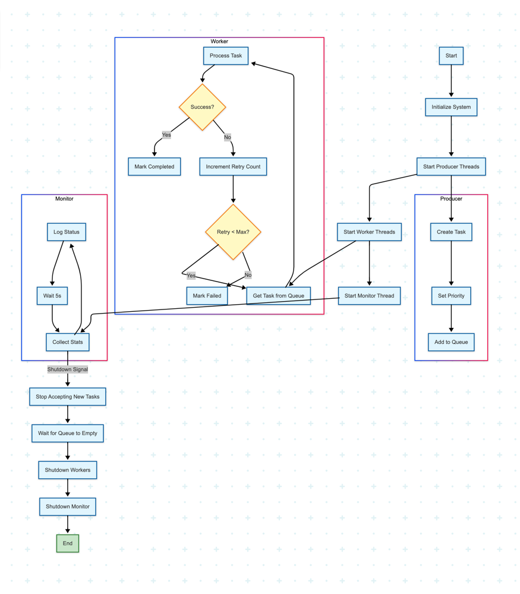

# ConcurQueue – A Multithreaded Job Processing Platform

[](https://www.oracle.com/java/technologies/javase-jdk17-downloads.html)
[](https://maven.apache.org/)
[](https://opensource.org/licenses/MIT)

**ConcurQueue** is a high-performance, multithreaded job dispatch system built with Java. It simulates a real-world backend service where multiple producer clients submit jobs with varying priorities, and a pool of worker threads processes them concurrently. This project serves as a practical demonstration of core Java concurrency primitives, including thread pools, blocking queues, concurrent collections, and synchronization mechanisms.

---

## 🚀 Key Features

- **Concurrent Worker Pool**: Utilizes `ExecutorService` for a fixed pool of worker threads to process tasks in parallel.
- **Priority-Based Processing**: Employs a `PriorityBlockingQueue` to ensure high-priority tasks are processed before lower-priority ones.
- **Dynamic Producer Strategies**: Simulates multiple producers with different behaviors (e.g., submitting high-priority, low-priority, or mixed-priority tasks).
- **Robust Task Lifecycle Management**: Tracks task status (`SUBMITTED`, `PROCESSING`, `COMPLETED`, `FAILED`) using a `ConcurrentHashMap`.
- **Automatic Retries**: Failed tasks are automatically re-queued up to a configurable number of times.
- **Advanced Monitoring & Health Checks**:
    - Logs real-time queue size, throughput, and worker status.
    - **Stalled Worker Detection**: Automatically detects and logs warnings if no tasks have been completed for a configurable duration.
    - **JSON Status Export**: Periodically exports the status of all tasks to a `task_status.json` file for external analysis.
- **Graceful Shutdown**: Implements a shutdown hook to ensure all tasks are processed and resources are released cleanly.
- **Concurrency Demonstrations**: Includes a separate module to illustrate common concurrency issues:
    - **Race Conditions**: Shows the difference between an unsafe and a thread-safe (atomic) counter.
    - **Deadlocks**: Provides a clear example of a deadlock scenario between two threads.

---

## 🏗️ System Architecture

The system is designed around a central `TaskDispatcher` that orchestrates the flow of tasks from producers to consumers.



1.  **Task Producers**: Independent threads that simulate clients submitting tasks to the system. Each producer can have a specific strategy for the priority of tasks it generates.
2.  **TaskDispatcher**: The core of the system. It manages a `PriorityBlockingQueue` to hold incoming tasks and an `ExecutorService` (the worker pool) to process them.
3.  **Worker Threads**: A pool of threads that fetch tasks from the queue and execute them.
4.  **Monitor**: A background scheduler that provides periodic health checks, detects stalls, and exports status reports.

---

## 🛠️ Getting Started

### Prerequisites

- [Java 17 or higher](https://www.oracle.com/java/technologies/javase-jdk17-downloads.html)
- [Apache Maven 3.8.1 or higher](https://maven.apache.org/download.cgi)

### Installation & Running

1.  **Clone the repository:**
    ```sh
    git clone https://github.com/your-username/ConcurQueue.git
    cd ConcurQueue
    ```

2.  **Build the project using Maven:**
    ```sh
    mvn clean package
    ```

3.  **Run the main application:**
    This will start the producers, workers, and monitoring system.
    ```sh
    mvn exec:java -Dexec.mainClass="com.example.clb.Main"
    ```
    You will see logs in your console, and a `task_status.json` file will be created in the project root.

4.  **Run the Concurrency Demonstrations:**
    To see the race condition and deadlock examples, run the `SynchronizationDemo` class.
    ```sh
    mvn exec:java -Dexec.mainClass="com.example.clb.demo.SynchronizationDemo"
    ```
    **Note**: The deadlock demonstration is commented out by default because it will intentionally hang the application. You can uncomment it in the `main` method of `SynchronizationDemo.java` to observe the behavior.

---

## ⚙️ Configuration

You can easily configure the system's behavior by modifying the constants in `src/main/java/com/example/clb/Main.java`:

- `NUM_PRODUCERS`: Number of producer threads.
- `TASKS_PER_PRODUCER`: Number of tasks each producer will create.
- `NUM_WORKERS`: Number of worker threads in the pool.
- `QUEUE_CAPACITY`: The maximum number of tasks the queue can hold before producers block.
- `MAX_RETRIES`: The number of times a failed task will be retried.

---

## 📂 Project Structure

```
.
├── pom.xml                   # Maven project configuration
├── task_status.json          # Auto-generated JSON report of task statuses
└── src
    └── main
        └── java
            └── com
                └── example
                    └── clb
                        ├── Main.java                 # Main application entry point
                        ├── demo/
                        │   └── SynchronizationDemo.java # Demonstrates race conditions & deadlocks
                        ├── model/
                        │   ├── Task.java             # The Task data model (implements Comparable)
                        │   └── TaskStatus.java       # Enum for task statuses
                        ├── producer/
                        │   └── TaskProducer.java     # Simulates task producers with priority strategies
                        └── service/
                            └── TaskDispatcher.java   # Core class: manages queue, workers, and monitoring
```

---

## 🧪 Testing

To run the suite of unit tests for the project:

```sh
mvn test
```

---

## 📜 License

This project is licensed under the MIT License. See the [LICENSE](LICENSE) file for more details.
